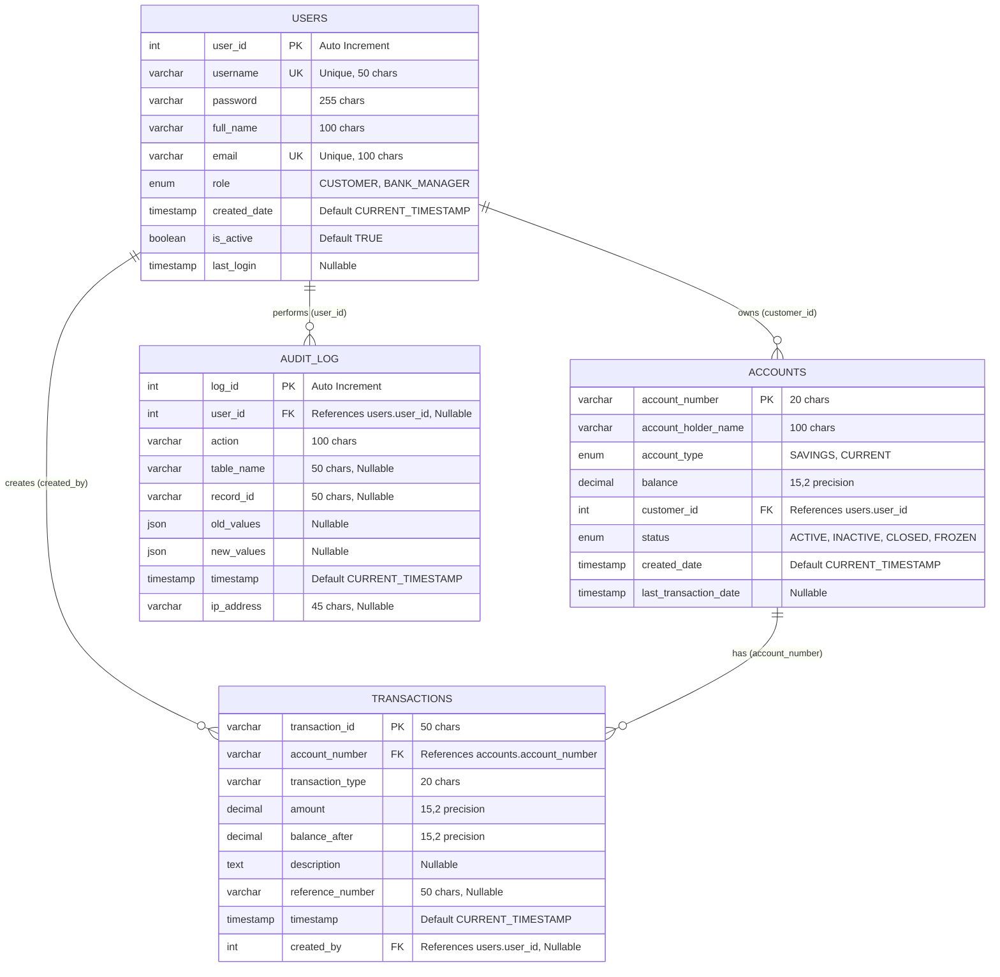

# Smart Banking System - Entity Relationship Diagram

## Database ER Diagram

## Detailed Entity Descriptions

### 1. USERS Entity
**Purpose**: Stores information about all system users (customers and bank managers)

| Attribute | Type | Constraints | Description |
|-----------|------|-------------|-------------|
| user_id | INT | PRIMARY KEY, AUTO_INCREMENT | Unique identifier for each user |
| username | VARCHAR(50) | UNIQUE, NOT NULL | Login username |
| password | VARCHAR(255) | NOT NULL | Encrypted password |
| full_name | VARCHAR(100) | NOT NULL | User's full name |
| email | VARCHAR(100) | UNIQUE, NOT NULL | Email address |
| role | ENUM | NOT NULL | CUSTOMER or BANK_MANAGER |
| created_date | TIMESTAMP | DEFAULT CURRENT_TIMESTAMP | Account creation date |
| is_active | BOOLEAN | DEFAULT TRUE | Account status |
| last_login | TIMESTAMP | NULL | Last login timestamp |

**Indexes**: 
- `idx_username` on username
- `idx_email` on email

### 2. ACCOUNTS Entity
**Purpose**: Stores bank account information for customers

| Attribute | Type | Constraints | Description |
|-----------|------|-------------|-------------|
| account_number | VARCHAR(20) | PRIMARY KEY | Unique account identifier |
| account_holder_name | VARCHAR(100) | NOT NULL | Account holder's name |
| account_type | ENUM | NOT NULL | SAVINGS or CURRENT |
| balance | DECIMAL(15,2) | NOT NULL, DEFAULT 0.00 | Current account balance |
| customer_id | INT | FOREIGN KEY, NOT NULL | References users.user_id |
| status | ENUM | DEFAULT 'ACTIVE' | Account status |
| created_date | TIMESTAMP | DEFAULT CURRENT_TIMESTAMP | Account creation date |
| last_transaction_date | TIMESTAMP | NULL | Last transaction timestamp |

**Indexes**:
- `idx_customer_id` on customer_id
- `idx_account_type` on account_type
- `idx_status` on status

### 3. TRANSACTIONS Entity
**Purpose**: Records all financial transactions

| Attribute | Type | Constraints | Description |
|-----------|------|-------------|-------------|
| transaction_id | VARCHAR(50) | PRIMARY KEY | Unique transaction identifier |
| account_number | VARCHAR(20) | FOREIGN KEY, NOT NULL | References accounts.account_number |
| transaction_type | VARCHAR(20) | NOT NULL | Type of transaction |
| amount | DECIMAL(15,2) | NOT NULL | Transaction amount |
| balance_after | DECIMAL(15,2) | NOT NULL | Balance after transaction |
| description | TEXT | NULL | Transaction description |
| reference_number | VARCHAR(50) | NULL | Reference for transfers |
| timestamp | TIMESTAMP | DEFAULT CURRENT_TIMESTAMP | Transaction timestamp |
| created_by | INT | FOREIGN KEY, NULL | References users.user_id |

**Indexes**:
- `idx_account_number` on account_number
- `idx_transaction_type` on transaction_type
- `idx_timestamp` on timestamp
- `idx_amount` on amount

### 4. AUDIT_LOG Entity
**Purpose**: Tracks all system activities for security and compliance

| Attribute | Type | Constraints | Description |
|-----------|------|-------------|-------------|
| log_id | INT | PRIMARY KEY, AUTO_INCREMENT | Unique log entry identifier |
| user_id | INT | FOREIGN KEY, NULL | References users.user_id |
| action | VARCHAR(100) | NOT NULL | Action performed |
| table_name | VARCHAR(50) | NULL | Affected table name |
| record_id | VARCHAR(50) | NULL | Affected record ID |
| old_values | JSON | NULL | Previous values |
| new_values | JSON | NULL | New values |
| timestamp | TIMESTAMP | DEFAULT CURRENT_TIMESTAMP | Action timestamp |
| ip_address | VARCHAR(45) | NULL | User's IP address |

**Indexes**:
- `idx_user_id` on user_id
- `idx_action` on action
- `idx_timestamp` on timestamp

## Relationships

### 1. USERS to ACCOUNTS (One-to-Many)
- **Relationship**: One user can have multiple accounts
- **Foreign Key**: accounts.customer_id → users.user_id
- **Cardinality**: 1:N
- **Delete Rule**: CASCADE (when user is deleted, their accounts are deleted)

### 2. ACCOUNTS to TRANSACTIONS (One-to-Many)
- **Relationship**: One account can have multiple transactions
- **Foreign Key**: transactions.account_number → accounts.account_number
- **Cardinality**: 1:N
- **Delete Rule**: CASCADE (when account is deleted, its transactions are deleted)

### 3. USERS to TRANSACTIONS (One-to-Many)
- **Relationship**: One user can create multiple transactions
- **Foreign Key**: transactions.created_by → users.user_id
- **Cardinality**: 1:N
- **Delete Rule**: SET NULL (when user is deleted, created_by becomes NULL)

### 4. USERS to AUDIT_LOG (One-to-Many)
- **Relationship**: One user can have multiple audit log entries
- **Foreign Key**: audit_log.user_id → users.user_id
- **Cardinality**: 1:N
- **Delete Rule**: SET NULL (when user is deleted, user_id becomes NULL)

## Business Rules

### User Management
1. Each user must have a unique username and email
2. Users can be either CUSTOMER or BANK_MANAGER
3. Only active users can perform transactions
4. Bank managers can access all accounts and transactions

### Account Management
1. Each account must belong to a customer (user with CUSTOMER role)
2. Account numbers are unique across the system
3. Accounts can be SAVINGS or CURRENT type
4. Only ACTIVE accounts can perform transactions
5. Account balance cannot go below minimum balance (varies by type)

### Transaction Management
1. All transactions must reference a valid account
2. Transaction amounts must be positive
3. Balance after transaction must be calculated and stored
4. Transfer transactions require reference numbers for tracking
5. All transactions are logged with timestamps

### Audit and Security
1. All system activities are logged in audit_log
2. User actions are tracked with IP addresses
3. Data changes are recorded with old and new values
4. Audit logs are never deleted (for compliance)

## Data Integrity Constraints

### Primary Keys
- All tables have primary keys for unique identification
- Auto-increment used for system-generated IDs

### Foreign Keys
- Referential integrity maintained through foreign key constraints
- Appropriate cascade and set null rules defined

### Unique Constraints
- Username and email are unique in users table
- Account numbers are unique across all accounts

### Check Constraints (Application Level)
- Balance must be >= minimum balance for account type
- Transaction amounts must be positive
- Enum values are enforced at database level

### Indexes
- Strategic indexes on frequently queried columns
- Composite indexes for complex queries
- Foreign key columns are indexed for performance

This ER diagram represents a robust, normalized database design that supports all banking operations while maintaining data integrity and audit trails.